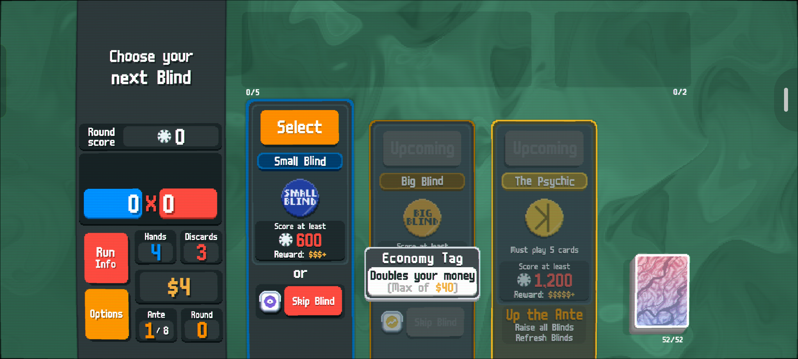

# Balatro Soul Reroller

An ADB helper that keeps restarting Balatro runs until it finds a **Charm Tag**
on the Small or Big Blind and then finds **The Soul** in the Arcana Pack it
opens.

> Built for a very specific setup: Balatro on a OnePlus 8T, running at
> 2400x1080 in landscape mode. The script uses fixed screen coordinates.



## Quick start

If this is your first phone, follow [FirstTime.md](FirstTime.md) first. Once
the phone is paired and the local tools are installed:

```sh
./run.sh PHONE_IP:ADB_PORT
```

For later runs, the last address is saved locally, so this is enough:

```sh
./run.sh
```

Before starting, open Balatro and leave it on any screen where the **Options**
button is visible. The selected deck and stake are used as-is; the original
setup was Plasma Deck / White Stake.

When The Soul is found, the script selects it and stops. It does not press
**Use**, so finish that last tap on the phone yourself. Successful and failed
captures are written locally as `soul_*.png` and `debug_*.png`; the run log is
`reroll.log`.

Stop the loop with `Ctrl+C`.

## What the loop does

```text
Play -> read blind tags -> Charm? -> skip to the blind
  ^                                      |
  |                                      v
  +---------- no Charm <----- Arcana Pack -> The Soul?
                                             |
                                          found: select + stop
```

Each cycle grabs only the strip containing the blind tags and Skip buttons.
That keeps the Wi-Fi transfer small while the next New Run menu is opening.
The detector looks for Charm's purple pixels first and uses a tooltip OCR check
for uncertain cases. If a Charm Tag is confirmed, the script skips to its blind,
checks the Arcana Pack, and looks for The Soul by its dark blue card artwork.

The tag images in [`tags/`](tags/) are a small learned library used to put names
in the log. The color detector does the actual Charm check, so the library is
not required for the core detection path.

## Requirements

- macOS with `adb`, `tesseract`, and [`uv`](https://docs.astral.sh/uv/)
- An Android phone with Balatro installed
- Wireless ADB enabled and the phone connected to the same network
- A 2400x1080 landscape display (the current coordinates assume this exactly)

The one-time setup is documented in [FirstTime.md](FirstTime.md).

## Files

| File | Purpose |
| --- | --- |
| `reroll.py` | Main detection and reroll loop |
| `run.sh` | Connects to ADB, prepares the virtual environment, and starts the loop |
| `notify_soul.sh` | Optional macOS notification and sound when The Soul is found |
| `tags/` | Learned tag crops and signatures used for log labels |
| `ref_charm_blind_screen.png` | Calibration/reference screenshot |
| `requirements.txt` | Python dependency list (`Pillow`) |

## Troubleshooting

If the phone is not detected, check that wireless debugging is still enabled
and reconnect with the current `IP:PORT` shown by Android. The pairing port and
the connection port are different.

If Balatro's layout changes, capture a frame and adjust the constants near the
top of `reroll.py`:

```sh
adb exec-out screencap -p > screen.png
```

To test the Charm classifier against a saved frame:

```sh
.venv/bin/python -c "import reroll; from PIL import Image; im=Image.open('screen.png').convert('RGB'); print(reroll.classify(im, reroll.SMALL_TAG), reroll.classify(im, reroll.BIG_TAG))"
```

If every run looks suspiciously similar, increase the tap jitter in
`reroll.py`. Balatro uses cursor position when generating a seed, so a little
variation matters.

## Disclaimer

This is a personal automation script for Balatro. It is not affiliated with or
endorsed by the game's developers.
